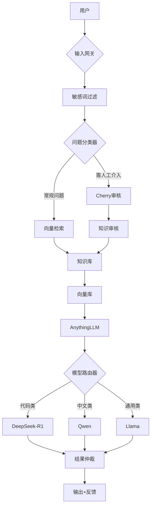

```mermaid
graph TB
    A[用户] --> B{输入网关}
    B --> C[敏感词过滤]
    C --> D{问题分类器}
    D -->|常规问题| E[向量检索]
    D -->|需人工介入| F[Cherry审核]
    E --> G[知识库]
    G --> H[向量库]
    H --> I[AnythingLLM]
    F --> J[知识审核]
    J --> G
    I --> K{模型路由器}
    K -->|代码类| L[DeepSeek-R1]
    K -->|中文类| M[Qwen]
    K -->|通用类| N[Llama]
    L & M & N --> O[结果仲裁]
    O --> P[输出+反馈]
```