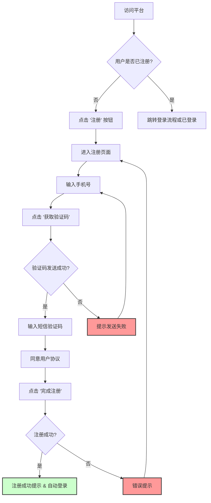
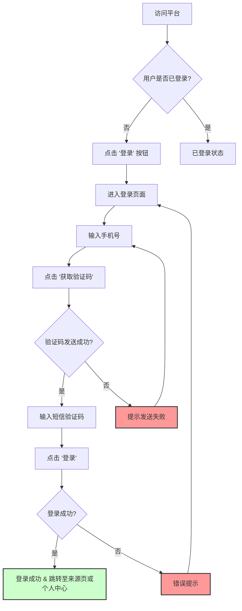
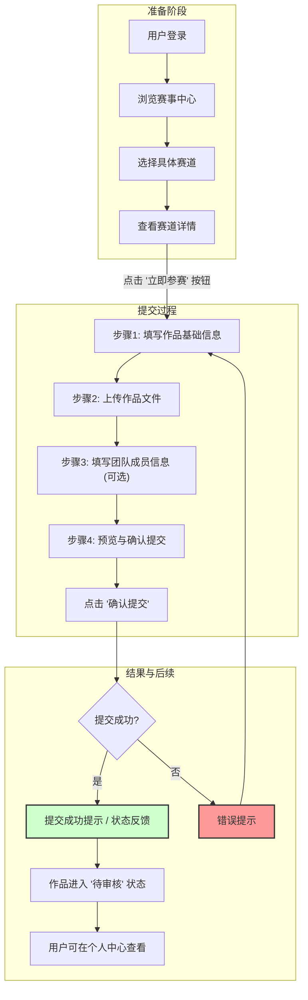
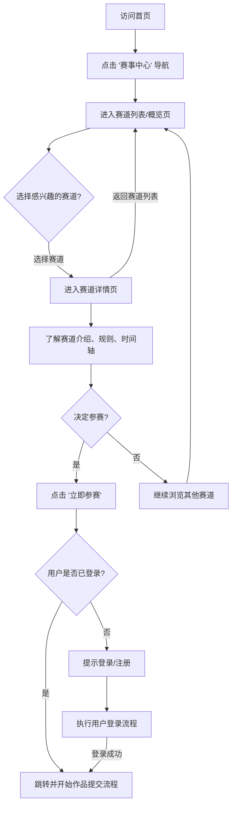
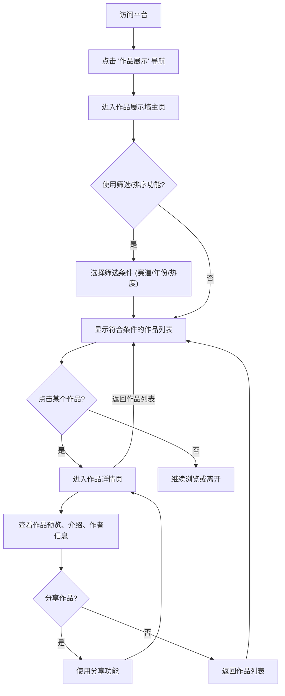
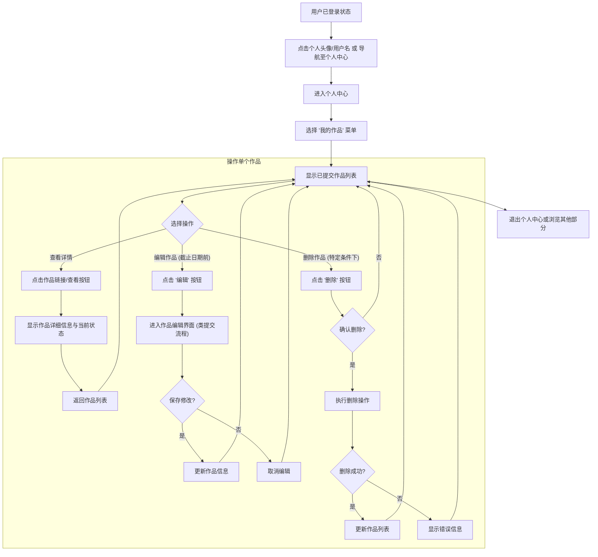

好的，我已经根据 `pm-docs/IA-design.md` 文件中的信息架构 (IA) 描述，为您绘制了以下几个核心用户流程图。这些流程图旨在可视化用户完成关键任务（如注册、登录、提交作品等）的步骤。

请注意，我已忽略 `pm-docs/user-flows.md` 文件。

以下是使用 Mermaid 语法绘制的用户流程图：

## 1. 用户注册流程 (User Registration Flow)

此流程描述了新用户如何在平台上创建账户。

## 2. 用户登录流程 (User Login Flow)

此流程描述了已注册用户如何登录平台。

## 3. 作品提交流程 (Submission Flow)

此流程描述了用户登录后如何提交参赛作品。

## 4. 浏览赛事与参赛流程 (Browse Competition & Participate Flow)

此流程描述了用户如何浏览不同的赛道并决定参赛。

## 5. 浏览作品流程 (Browse Gallery/Showcase Flow)

此流程描述了用户如何浏览平台上的作品展示。

## 6. 个人中心管理作品流程 (Manage Submissions in User Center Flow)

此流程描述了登录用户如何在个人中心管理他们提交的作品。

